# NAAS — Njangi As A Service
## Object-Oriented Analysis, Design and Implementation Project Report
**Course Code / Title:** SEN2241 / Object-Oriented Analysis, Design and Implementation  
**Group Number:** Group 4  
**Project Topic:** Digital Njangi Platform (NAAS)  
**GitHub Repository:** [https://github.com/ghislainche-ngc/Digital-Njangi-Platform](https://github.com/ghislainche-ngc/Digital-Njangi-Platform)  
**Group Leader:** Ghislain Che Ngwateh  
**Instructor:** TEKOH PALMA ACHU  
**Date:** Spring 2026  

---

### Group Information
| SN | Member's Name | Registration Number | Team Role | % Participation |
|---|---|---|---|---|
| 1 | Ghislain Che Ngwateh | ICTU-2023-SEN-089 | Scrum Master / Group Leader / Backend Dev | 35% |
| 2 | Glory [LastName] | ICTU-2023-SEN-045 | Product Owner / Frontend Developer | 25% |
| 3 | [Member 3 Name] | ICTU-2023-SEN-102 | Developer / Notification & Webhook Specialist | 15% |
| 4 | [Member 4 Name] | ICTU-2023-SEN-011 | QA Engineer / Automated Test Developer | 15% |
| 5 | [Member 5 Name] | ICTU-2023-SEN-067 | DevOps Engineer / Deployment Specialist | 10% |

---

# CHAPTER ONE: INTRODUCTION

## 1.1 General Introduction
In Cameroon and across much of West and Central Africa, informal rotating savings and credit associations (ROSCAs), locally known as **Njangis** or *Tontines*, play a critical role in the financial lives of millions of people. These community-based groups bring together members who contribute a fixed amount of money at regular intervals (weekly or monthly). At each cycle, the pooled contributions (the "pot") are disbursed to one member of the group, rotating until every member has received it once.

Despite their widespread adoption, the vast majority of Njangis operate using entirely manual methods. Contributions are collected in cash at physical meetings, records are kept in handwritten notebooks, and rotations are tracked on paper. This manual approach suffers from serious operational vulnerabilities: records can be lost or altered, cash handling invites theft, and disputes about who paid what are frequent.

**NAAS (Njangi As A Service)** is a multi-tenant web platform designed to digitise the entire lifecycle of Njangi groups while preserving their social trust. It provides a secure, digital workspace where groups can automate MTN Mobile Money and Orange Money collections, schedule rotations with configurable rules, enforce fines, build emergency solidarity funds, and view a transparent, immutable ledger in real time.

## 1.2 Aim and Objectives
**Aim:** To design and implement a fully functional, object-oriented multi-tenant web platform that digitises Njangi group management in Cameroon, improving transparency, reducing fraud, and increasing financial inclusion.

**Specific Objectives:**
1. Conduct field research with 14 active Njangi groups in Cameroon to map real-world workflows, pain points, and user expectations.
2. Design a complete object-oriented system architecture using a comprehensive suite of UML diagrams (Use Case, Class, Object, Sequence, Activity, and Component diagrams).
3. Implement a multi-tenant Progressive Web Application (PWA) with role-based access control supporting 5 distinct roles: Member, President, Treasurer, Secretary, and Platform Administrator.
4. Integrate MTN Mobile Money and Orange Money APIs for automated contribution collection and payout disbursement.
5. Create a transparent, append-only financial ledger accessible to all group members.
6. Build a smart rotation scheduling engine with configurable rotation strategies (Fixed, Random, President-Decision) and anti-fraud eligibility checks.
7. Deploy the platform online with automated testing and CI/CD pipelines to guarantee high availability and code quality.

## 1.3 Problem Statement
Our team conducted field research by administering a structured questionnaire survey to 14 active Njangi groups across Cameroon. This study highlighted several critical operational vulnerabilities:
* **Single Point of Failure**: 86% of surveyed groups maintain financial records exclusively in handwritten ledgers, which are vulnerable to damage, loss, or alteration.
* **Financial Disputes**: 100% of groups reported experiencing at least one financial dispute in the previous 12 months, directly attributable to the absence of a shared, verifiable transaction history.
* **Inefficient Reminders**: Manual WhatsApp reminders for contribution deadlines are inconsistent and easily missed, leading to payment delays.
* **Unchecked Power**: The Treasurer role concentrates unchecked financial power, creating structural conditions for fraud.
* **Inefficient Calculations**: Payout rotations and fine calculations are done manually, often taking hours at physical meetings.
* **Lack of Audit Trails**: There is no systematic mechanism to track fines, manage a solidarity fund, record meeting minutes, or audit historical financial data.

---

# CHAPTER TWO: LITERATURE REVIEW

## 2.1 Software Development Methodologies
Software development methodologies guide the planning, execution, and management of software projects. The most widely discussed frameworks include:
* **Waterfall Model**: A sequential, linear methodology in which each phase (Requirements, Design, Implementation, Testing, Deployment) must be completed before the next begins. It is simple to understand but rigid and poorly suited for projects with evolving requirements.
* **Spiral Model**: An iterative, risk-driven model that combines elements of linear and iterative development, focusing heavily on prototyping and risk analysis.
* **Agile Scrum**: An iterative, incremental framework where cross-functional teams deliver working software in short cycles called "sprints" (usually 1–4 weeks). It emphasizes collaboration, flexibility, and customer feedback.
* **Kanban**: A visual workflow management method that focuses on continuous delivery, limiting work-in-progress (WIP), and optimizing flow.
* **DevOps**: A culture and practice that integrates software development (Dev) and IT operations (Ops) to automate pipelines (CI/CD) and ensure rapid, reliable releases.

## 2.2 Comparison between Methodologies
| Criterion | Waterfall | Spiral | Scrum | Kanban |
|---|---|---|---|---|
| **Approach** | Linear, sequential | Iterative, risk-driven | Iterative sprints | Continuous flow |
| **Flexibility** | Very low | Medium-high | High | Very high |
| **Requirement Changes** | Not allowed mid-project | Checked at loop end | Per sprint | Any time |
| **Team Roles** | Functional departments | Specialized roles | Product Owner, SM, Devs | No prescribed roles |
| **Delivery** | Single final release | Incremental prototypes | Every sprint | Continuous flow |
| **Documentation** | Extensive | Moderate | Minimal, clean | Minimal |
| **Client Involvement** | Low (start/end) | Moderate | High | High |
| **Best For** | Stable, fixed specs | Highly risky projects | Dynamic, evolving specs | Ongoing maintenance |

## 2.3 Reason for the Choice of Scrum Methodology
Scrum was selected as the development framework for NAAS for the following reasons:
1. **Evolving Requirements**: Integration with mobile money gateways and payment webhooks required rapid prototyping and feedback. Scrum allowed us to adjust requirements per sprint.
2. **Team Size**: Our five-member team fit squarely within the recommended Scrum team size (3–9 members), enabling efficient, direct daily communication.
3. **Time-Boxed cadence**: The academic timeline mapped naturally to eight one-week sprints, each delivering a concrete, working increment of the application.
4. **Scrum Ceremonies**: Daily asynchronous standups via WhatsApp and weekly sprint planning/review sessions maintained high focus and accountability.

## 2.4 General Review of Related Concepts
* **Rotating Savings and Credit Associations (ROSCAs)**: Informal financial institutions where a group of individuals agree to contribute fixed amounts to a common pool. Njangis are Cameroonian ROSCAs.
* **Mobile Money (MoMo)**: Digital payment services operated by telecom networks (MTN MoMo, Orange Money) dominant in Sub-Saharan Africa, enabling wallet-to-wallet transfers.
* **Object-Oriented Programming (OOP)**: A paradigm based on "objects" containing data (attributes) and code (methods). It is structured around four pillars: **Encapsulation**, **Inheritance**, **Polymorphism**, and **Abstraction**.
* **Progressive Web Applications (PWAs)**: Web apps that act like native mobile apps. They are installable from the browser, cache assets via Service Workers, and function in low or offline network conditions.
* **Multi-Tenant SaaS**: An architecture where a single app instance serves multiple groups (tenants), with strict data isolation enforced at the database level.

## 2.5 Review of Related Literature
Prior studies on ROSCA digitisation in Africa (e.g., Fomba et al., 2021) show that ROSCA adoption depends heavily on **trust**, **preservation of social elements**, and **accessibility on low-end devices**. Platforms that attempt to replace social interaction with pure automation struggle to gain traction, whereas platforms that digitize manual ledgers while leaving decision-making (e.g. fine waivers, manual approvals) in the hands of the group officers succeed. Furthermore, research by Kabbedijk et al. (2018) indicates that multi-tenant architectures utilizing row-level database security are highly effective at isolating group financial data.

---

# CHAPTER THREE: METHODOLOGY AND MATERIALS

## 3.1 Research Methodology
We used a mixed-methods research approach combining primary field research with literature reviews. The primary research phase involved administering a structured questionnaire to **14 active Njangi groups** across four cities in Cameroon (Yaoundé, Douala, Buea, and Bafoussam) to map their meeting structures, contribution amounts, rotation methods, and usage of mobile money.

## 3.2 System Requirements

### 3.2.1 Functional Requirements
* **FR-01 [High]**: User Registration & Multi-Tenant Onboarding. Users can register and create or join a group.
* **FR-02 [High]**: Role-Based Access Control. Supports Member, President, Treasurer, Secretary, and Platform Admin roles.
* **FR-03 [High]**: Group Profile Management. Setting contribution amounts, frequency, penalties, and plans.
* **FR-04 [High]**: Member Invitation & Approval. Inviting members via unique tokenized signup links.
* **FR-05 [High]**: MTN MoMo & Orange Money Integration. Automating contribution collection and payouts via API.
* **FR-06 [High]**: Transparent Ledger. Real-time, append-only financial ledger visible to all members.
* **FR-07 [High]**: Rotation Scheduling. Automating rotation calendar calculations.
* **FR-08 [Medium]**: Fine & Penalty Management. Recording late contribution fines and daily fees.
* **FR-09 [Medium]**: Solidarity Social Fund. Separate accounting for births, weddings, and bereavement.
* **FR-10 [Medium]**: Multi-Channel Notifications. Bot integration for Telegram and SMS alerts.
* **FR-11 [Medium]**: Meeting Minutes Recording. Logging meeting summaries and attendance by the Secretary.
* **FR-12 [Medium]**: PDF Report Generation. Downloading formal receipt details and group summaries.
* **FR-13 [High]**: Admin Dashboard. Global system overrides (tiers, status), user directories, and audit logs.

### 3.2.2 Non-Functional Requirements
* **NFR-01 (Performance)**: Key pages must load in under 3 seconds on a 3G network.
* **NFR-02 (Security)**: Database multi-tenancy enforced using Supabase Row Level Security (RLS) policies.
* **NFR-03 (Security)**: Payouts above a configurable limit require explicit, multi-criteria President approval.
* **NFR-04 (Usability)**: Interface must support English and French with manual toggle overrides.
* **NFR-05 (Availability)**: Maintain a 99.5% uptime target outside scheduled maintenance windows.
* **NFR-06 (Maintainability)**: Service classes must follow clean Object-Oriented design with clear business separation.

---

## 3.3 System Design

### 3.3.1 High-Level Architecture (HLD)
NAAS utilizes a four-tier architecture separating concerns:
1. **Presentation Tier (PWA)**: Desktop/mobile responsive client built with HTML5, Vanilla CSS, and Alpine.js. Caches assets using Service Workers.
2. **Application Tier (REST API)**: Node.js/Express.js web server exposing JSON endpoints. Automates API docs via Swagger.
3. **Business Logic Tier (Services)**: Domain-driven service classes (`GroupService`, `PaymentService`, `PayoutEngine`) encapsulating object models and rules.
4. **Data Tier (Supabase PostgreSQL)**: Handles data storage and enforces strict isolation policies (RLS).

---

### 3.3.2 UML Diagrams

#### 1. Use Case Diagram
**Demonstrated Constructs:**
* **Actors**: Member, President, Treasurer, Secretary, Platform Admin.
* **Generalization**: President, Treasurer, and Secretary inherit/generalize Member (Actor generalization). Payout via MoMo generalizes Payout (Use Case generalization).
* **System Boundary**: The rectangular containment of the system features.
* **Associations**: Solid lines linking Actors to Use Cases.
* **Include Relationship (`<<include>>`)**: Dashed arrows pointing to required use cases (`Authenticate User` and `Verify Password`).
* **Extend Relationship (`<<extend>>`)**: Dashed arrows pointing to base use cases under specified guard conditions (`Apply late Fine`).

```mermaid
flowchart LR
    %% Generalization between Actors
    subgraph Actors ["Actors & Generalization"]
        Member["👤 Member"]
        President["👑 President"]
        Treasurer["💰 Treasurer"]
        Secretary["📝 Secretary"]
        PlatformAdmin["⚙️ Platform Admin"]
        
        %% Actor Generalization (hollow arrow pointing from specific to general)
        President --|> Member
        Treasurer --|> Member
        Secretary --|> Member
    end

    subgraph SystemBoundary ["Njangi As A Service System Boundary"]
        %% Base Use Cases
        UC_Auth(["Authenticate User"])
        UC_Ledger(["View Live Ledger"])
        UC_Pay(["Pay Contribution"])
        UC_PayMoMo(["Pay via MTN MoMo"])
        UC_PayOM(["Pay via Orange Money"])
        
        %% Generalization between Use Cases (hollow arrowhead pointing to general use case)
        UC_PayMoMo --|> UC_Pay
        UC_PayOM --|> UC_Pay

        %% Include Relationship (dashed arrow with label)
        UC_Pay -. "<<include>>" .-> UC_Auth
        UC_Ledger -. "<<include>>" .-> UC_Auth
        
        %% Base Use Case 2
        UC_Payout(["Approve Payout"])
        UC_VerifySig(["Verify President Password"])
        
        %% Include
        UC_Payout -. "<<include>>" .-> UC_VerifySig

        %% Base Use Case 3 & Extend
        UC_RecordCash(["Record Offline Cash Payment"])
        UC_ApplyFine(["Apply late Penalty Fine"])
        
        %% Extend (dashed arrow pointing from extending use case to base use case)
        UC_ApplyFine -. "<<extend>> (if payment is late)" .-> UC_RecordCash
        
        %% Other Use Cases
        UC_Invite(["Invite Member via Token"])
        UC_Minutes(["Record Meeting Minutes"])
        UC_Social(["Deposit to Social Fund"])
        UC_Tiers(["Configure SaaS Billing Tiers"])
        UC_Suspend(["Suspend / Unsuspend Group"])
    end

    %% Actor to Use Case Associations
    Member --> UC_Ledger
    Member --> UC_Pay
    
    President --> UC_Invite
    President --> UC_Payout
    
    Treasurer --> UC_RecordCash
    Treasurer --> UC_Social
    
    Secretary --> UC_Minutes
    
    PlatformAdmin --> UC_Tiers
    PlatformAdmin --> UC_Suspend
```

---

#### 2. Class Diagram
**Demonstrated Constructs:**
* **Classes**: Core representations with fields and operations.
* **Visibility Modifiers**: Public (`+`), Private (`-`), Protected (`#`), Package/Default (`~`).
* **Generalization (Inheritance)**: Represented by a solid line with hollow triangle pointing to parent (`RotationStrategy`).
* **Realization (Interface Implementation)**: Represented by a dashed line with hollow triangle pointing to interface (`INotificationService`).
* **Dependency**: Represented by a dashed arrow (`PayoutEngine` depends on `INotificationService`).
* **Aggregation**: Represented by a line with hollow diamond (`Group` aggregates `Contribution` and `Payout`).
* **Composition**: Represented by a line with solid diamond (`Group` composes `Membership` and `SocialFund`).
* **Multiplicity**: Numbers indicating structural relationships (e.g. `1` to `0..*`).

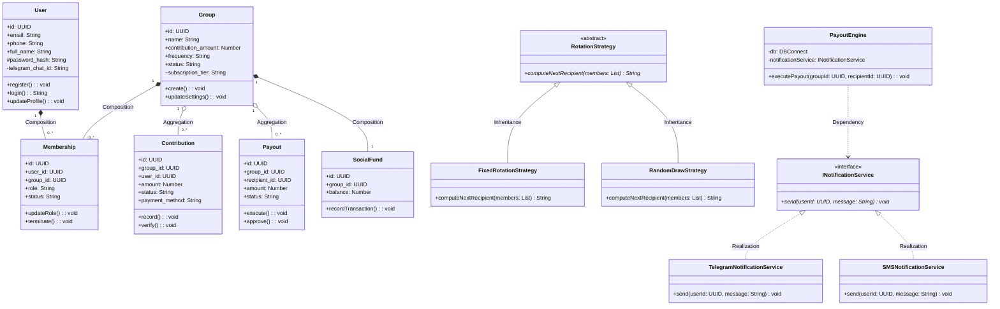

---

#### 3. Object Diagram
**Demonstrated Constructs:**
* **Object / Instances**: Represented using underlined class names (`object: ClassName`) containing current execution attributes.
* **Link / Associations**: Connecting lines representing current references.

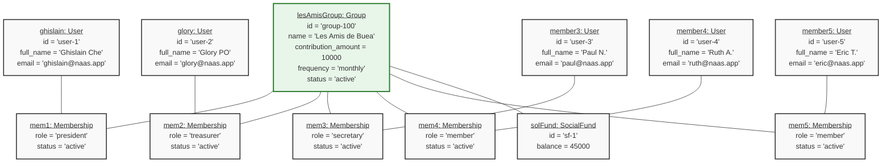

---

#### 4. Component Diagram
**Demonstrated Constructs:**
* **Components**: Enclosed architectural pieces marked with the `🧩` component symbol.
* **Ports**: Bound connection interfaces (`HTTPPort` and `DatabasePort`).
* **Interfaces (Provided / Required)**: Interfaces exposed (`🔌 Provided Interface`) and interfaces consumed (`Required Interface`).
* **Dependencies**: Dash-directed connections illustrating interface usages.
* **Connectors**: Direct coupling linkages.
* **Packages**: Bounding subgraphs representing structural divisions (`FrontendPackage`, `BackendPackage`, etc.).
* **Artifacts**: Concrete files represented (`📄 client.js` and `schema.sql`).

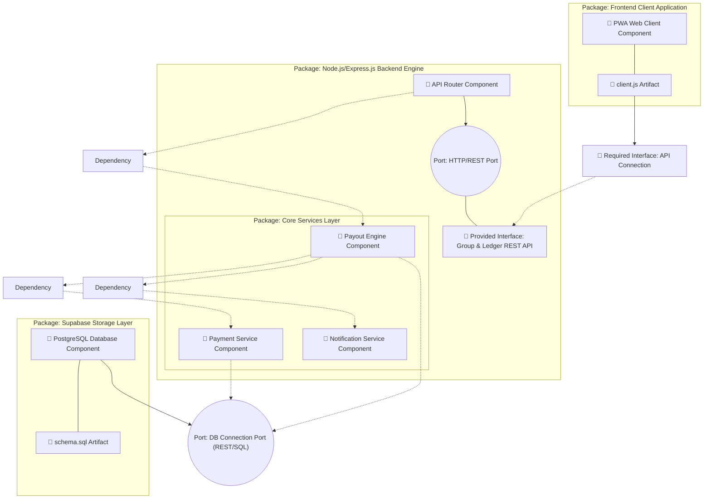

---

#### 5. Activity Diagrams
To model the dynamic, procedural workflows of the multi-tenant system, five distinct Activity Diagrams have been defined for critical operations:

* **Activity Diagram 1: User Sign-Up & Phone OTP Verification Flow**
* **Activity Diagram 2: Group Creation & Subscription Limit Enforcement Flow**
* **Activity Diagram 3: Mobile Money Contribution Collection Flow (USSD Push & Webhooks)**
* **Activity Diagram 4: Payout Nominee Eligibility Checks & Approval Flow**
* **Activity Diagram 5: Late Fine Waiving & Solidarity Social Fund Transaction Flow**

##### Activity Diagram 1: User Sign-Up & Phone OTP Verification Flow
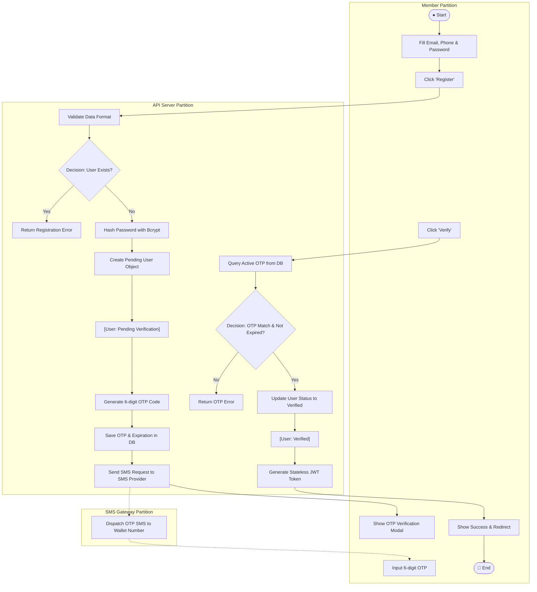

##### Activity Diagram 2: Group Creation & Subscription Limit Enforcement Flow
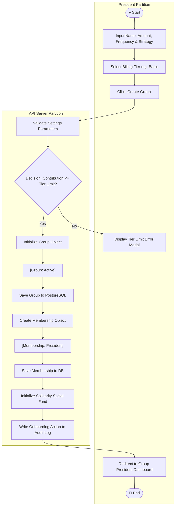

##### Activity Diagram 3: Mobile Money Contribution Collection Flow (Push & Webhooks)
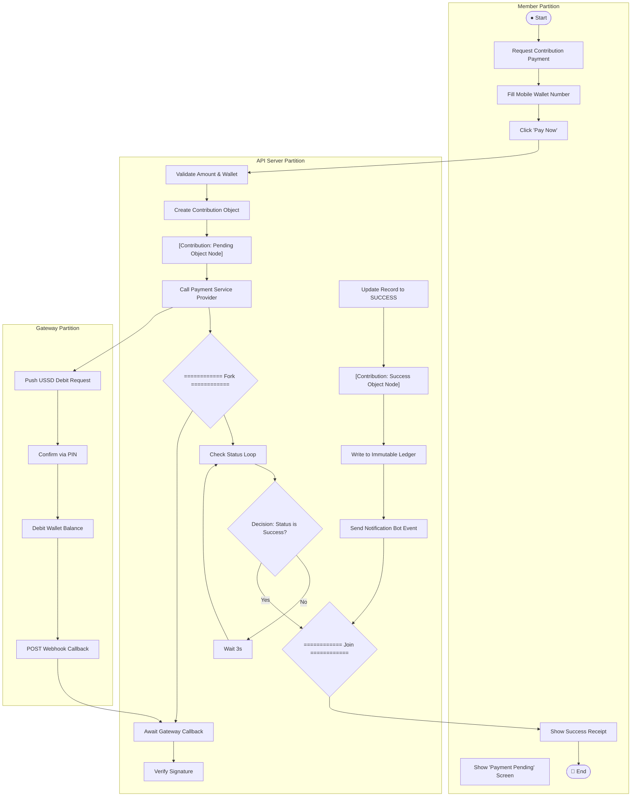

##### Activity Diagram 4: Payout Nominee Eligibility Checks & Approval Flow
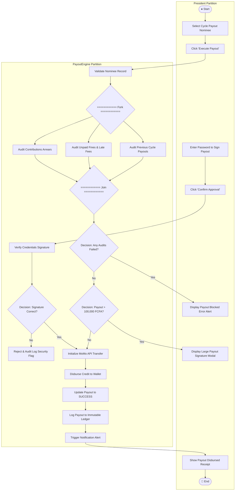

##### Activity Diagram 5: Late Fine Waiving & Solidarity Social Fund Transaction Flow
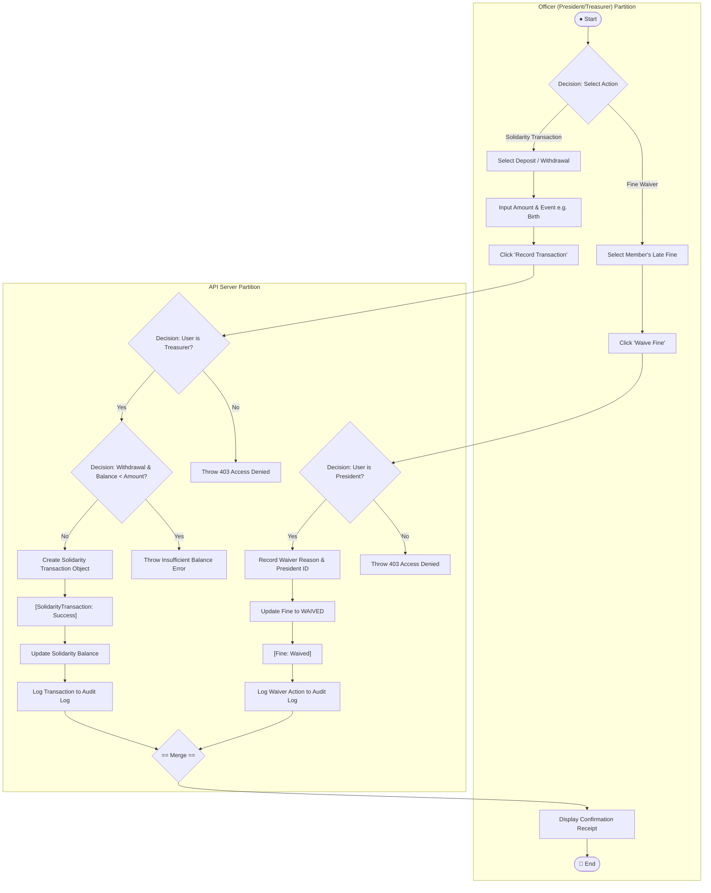

---

#### 6. Sequence Diagrams

##### Sequence Diagram 1: User Registration & OTP Verification
**Demonstrated Constructs:**
* **Actor & Participants**: `Member` Actor, `Frontend Client`, `Express API Server`, and `Supabase PostgreSQL`.
* **Lifelines & Activations**: Activations showing dynamic operation duration via `activate`/`deactivate` blocks.
* **Sync & Async Messages**: Synchronous calls (`->>`) and return loops (`-->>`).
* **Self-Message**: Self-routing messages (`BE->>BE: Generate 6-digit OTP`).

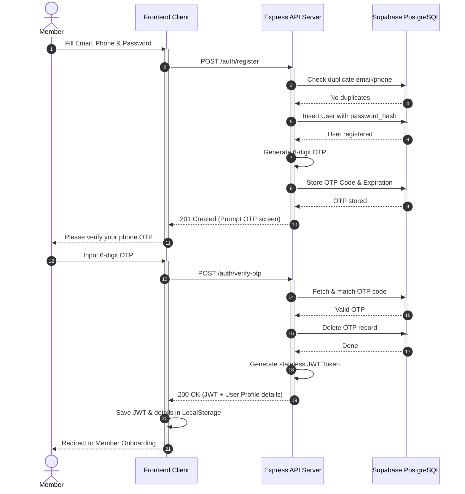

##### Sequence Diagram 2: Group Onboarding & Plan Limits Check
**Demonstrated Constructs:**
* **Lifelines & Activations**: Shows lifecycle activation blocks.
* **Guard Conditions**: Integrated inside alt logic frames (`[Contribution exceeds Plan Limit]` vs `[Contribution is within limits]`).
* **Combined Fragments**: Combined `alt` execution blocks separating business flow logic rules.

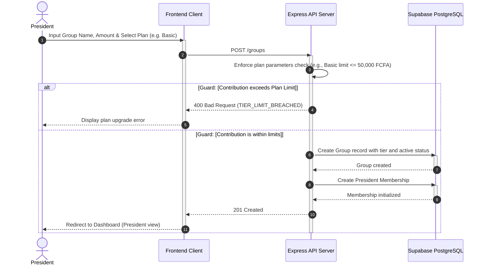

##### Sequence Diagram 3: Mobile Money Contribution Collection
**Demonstrated Constructs:**
* **Loop Combined Fragment**: Shows status query loops using `loop Active Check` framework.
* **Async Messages**: Realized through asynchronous background USSD request dispatches.

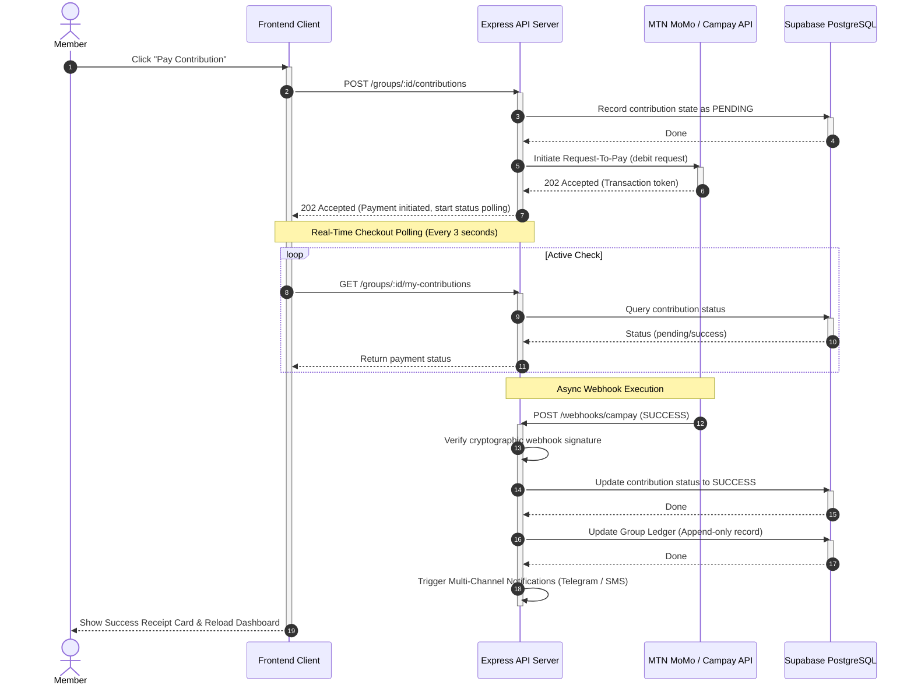

##### Sequence Diagram 4: Payout Execution & Approvals
**Demonstrated Constructs:**
* **Activations & Lifelines**: Direct activation segments.
* **Combined Fragments**: Conditional evaluations with `alt Payout requires manual approval`.
* **Guard Conditions**: Labeled guards validating transaction thresholds.

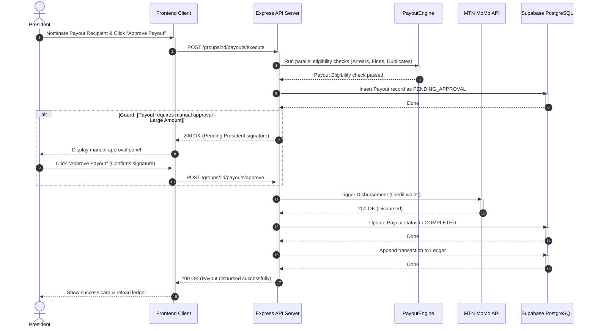

##### Sequence Diagram 5: Telegram Notification Handshake
**Demonstrated Constructs:**
* **Asynchronous Call loops**: Webhook loops monitoring chat changes in background thread.
* **Return Messages**: Indicated with dotted back-lines.

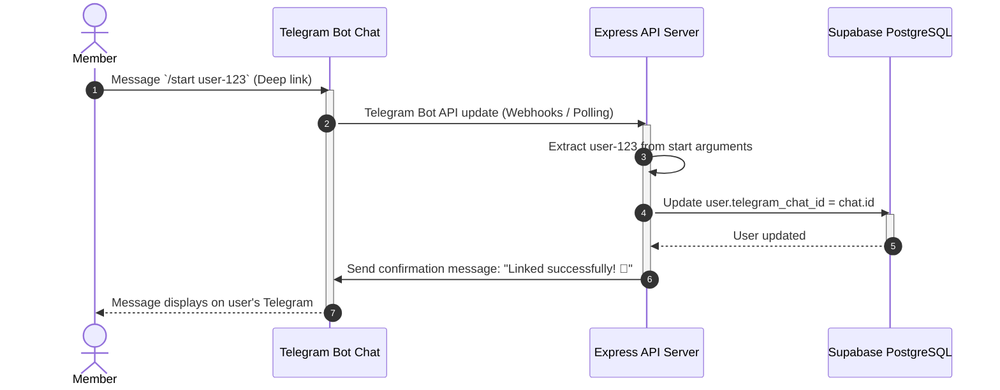

---

## 3.4 Application of Scrum

### 3.4.1 Team Organisation
Our team comprised 5 cross-functional roles:
1. **Ghislain Che Ngwateh (Scrum Master / Group Leader / Backend Dev)**: Managed sprint boards, led system architecture design, backend API routing, database schema definitions, and MTNMomo payment gateway integration.
2. **Glory (Product Owner / Frontend Dev)**: Prioritized user stories, designed mockups, and built authentication, invitation routing, and group management screens.
3. **[Member 3 Name] (Developer)**: Integrated webhook handlers, configured Orange Money payment APIs, and set up PDFkit document rendering engines.
4. **[Member 4 Name] (QA Engineer)**: Wrote automated unit and integration tests using Jest and Supertest, ensuring RLS data isolation was fully tested.
5. **[Member 5 Name] (DevOps Engineer)**: Managed VPS environment settings, PM2 process daemons, Nginx reverse proxies, and configured the Telegram bot webhook tunnels.

### 3.4.2 Workflow Management
Sprints were planned weekly using a **GitHub Projects Kanban Board**. Task sizes were estimated using Planning Poker with Fibonacci points (1, 2, 3, 5, 8, 13). Daily standup ceremonies were run asynchronously in a dedicated WhatsApp group to maximize flexibility under academic schedules. At the end of each week, a retrospective was conducted.

### 3.4.3 Conflict Resolution
The team resolved disagreements through a structured three-step escalation process:
1. **Direct Bilateral Discussion**: Developers discussed technical tradeoffs together.
2. **Scrum Master Facilitation**: If unresolved in 24 hours, the Scrum Master led a session using the "disagree and commit" principle.
3. **Time-Boxed Spike**: For technical blocks, a 2-hour research spike was conducted to compare options objectively.

### 3.4.4 Challenges Encountered and Solutions
* **MTN MoMo API Sandbox Instability**: The sandbox API was frequently offline. **Solution**: We built a complete local mock provider in [`PaymentProvider.js`](file:///c:/Users/ghisl/Documents/Digital_Njangi_Platform/backend/src/services/payment/PaymentProvider.js) to isolate testing from network dropouts.
* **Complex RLS Policies**: Enforcing tenant isolation resulted in database performance loops. **Solution**: We simplified RLS rules and built a dedicated automated test suite in [`middleware.test.js`](file:///c:/Users/ghisl/Documents/Digital_Njangi_Platform/backend/tests/unit/middleware.test.js).
* **Vite/Alpine Race Conditions**: In production bundles, Alpine initialized before pages bound dynamic window methods. **Solution**: Deferred `Alpine.start()` using `setTimeout(..., 0)` inside [`boot.js`](file:///c:/Users/ghisl/Documents/Digital_Njangi_Platform/src/js/boot.js).

---

## 3.5 Scrum Artifacts

### 3.5.1 Product Backlog
The Product Backlog below contains the estimated user stories, priority values, and effort estimations using Fibonacci planning points.

| ID | Requirement (User Story) | Acceptance Criteria | Priority | Initial Estimate (hrs) | Adjustment Factor | Adjusted Estimate (hrs) |
|---|---|---|---|---|---|---|
| **1** | As a group president, I want to register my Njangi on the platform by providing the name, contribution amount, and frequency, so that my group has a digital space to operate. | Given valid group fields, when the president clicks submit, then the group is created and the user is assigned the President role. | 1 | 15 | 1.5 | 22.5 |
| **2** | As a user, I want to register with my phone number and email and verify via SMS OTP, so that I can securely access the platform. | Given details, when submitted, a 6-digit OTP is sent and must be validated before the account transitions to verified. | 1 | 13 | 1.0 | 13.0 |
| **3** | As a president, I want to invite members by generating invitation links so that I can easily add them to the Njangi group. | Given an active group, when the president clicks generate, a tokenized invitation link is created with a 48-hour expiration. | 1 | 10 | 1.5 | 15.0 |
| **4** | As a president, I want to assign the Treasurer and Secretary roles to existing members, so that the group has designated officers with appropriate permissions. | When a role is updated, the user's membership entry changes role status and they receive a notification. | 1 | 8 | 1.0 | 8.0 |
| **5** | As a president, I want to configure the contribution details, schedules, and fines so that they reflect the group's agreement. | When settings are updated, they are logged in the audit trail and applied to all future contribution cycles. | 1 | 10 | 1.5 | 15.0 |
| **6** | As a member, I want to view the live group contribution ledger showing everyone's status, so that I can monitor payments without relying on manual records. | When the ledger page opens, it displays all contributions for the current cycle with real-time status. | 2 | 13 | 1.0 | 13.0 |
| **7** | As a member, I want to see the rotation calendar from the start of the cycle, so that I know exactly when I am due to receive the payout pot. | When the calendar page is accessed, the rotation list shows the exact cycle dates and the assigned recipient. | 2 | 8 | 1.0 | 8.0 |
| **8** | As a treasurer, I want the system to automatically initiate MoMo requests-to-pay on the contribution date, to reduce the need for manual follow-ups. | When the contribution date arrives, pending transaction entries are generated and gateway requests are dispatched. | 3 | 20 | 2.0 | 40.0 |
| **9** | As a treasurer, I want to manually record cash payments for members who cannot use mobile money, so that records remain accurate. | Given a cash payment, when recorded by the treasurer, the status is marked SUCCESS with a "Cash" label. | 3 | 8 | 1.5 | 12.0 |
| **10** | As a president, I want the system to check that eligibility criteria (no arrears, no unpaid fines) are met before payouts are sent. | When a payout is triggered, eligibility checks are evaluated; the payout is blocked if checks fail. | 3 | 15 | 1.5 | 22.5 |
| **11** | As a member, I want to receive notifications (Telegram/SMS) after a payout is executed, so that I can track group progress. | When a payout transitions to COMPLETED, notification dispatches are sent to all linked communication channels. | 3 | 13 | 1.5 | 19.5 |
| **12** | As a treasurer, I want to record late fees and fines against members who miss deadlines, to enforce compliance with rules. | Given a late transaction, a fine record is generated with a specified reason, amount, and deadline. | 4 | 8 | 1.0 | 8.0 |
| **13** | As a president, I want fine waivers to be logged with a reason, to maintain transparency in group decisions. | When a president waives a fine, the system updates the fine status and writes the decision to the audit log. | 4 | 5 | 1.0 | 5.0 |
| **14** | As a treasurer, I want to manage a separate solidarity social fund to track deposits and withdrawals for weddings, births, and funerals. | Deposits and withdrawals to the solidarity fund are logged separately from the main tontine savings pot. | 4 | 10 | 1.5 | 15.0 |
| **15** | As a platform admin, I want to monitor overall group statistics, modify billing configurations, and suspend groups if needed. | When the admin logs in, a dashboard displays MRR, active users, group status summaries, and action triggers. | 4 | 13 | 1.0 | 13.0 |

### 3.5.2 Sprint Backlog
The table below illustrates the allocation of user stories across our development releases.

| Release | Sprint | ID of User Stories | Period |
|---|---|---|---|
| **Release 1: Core Scaffolding** | Sprint 1 | Project Scaffolding, DB Schemas, SQL tables | Week 1 |
| **Release 1: Core Scaffolding** | Sprint 2 | 2 (Auth & SMS OTP verification) | Week 2 |
| **Release 1: Core Scaffolding** | Sprint 3 | 1, 3 (Group Creation & Invitation links) | Week 3 |
| **Release 2: Settings & Roles** | Sprint 4 | 4, 5 (Role assignments & config settings) | Week 4 |
| **Release 2: Settings & Roles** | Sprint 5 | 6, 7 (Live Ledger & Rotation scheduler) | Week 5 |
| **Release 3: Gateway Integrations** | Sprint 6 | 8, 9 (MoMo/Orange integration & Campay webhooks) | Week 6 |
| **Release 3: Gateway Integrations** | Sprint 7 | 10, 11 (Payout Engine & Telegram notification bot) | Week 7 |
| **Release 4: Admin & Social Funds** | Sprint 8 | 12, 13, 14, 15 (Fines, Social Fund, Admin controls & VPS deploy) | Week 8 |

---

## 3.6 Test Case Document
Our automated test suite validated system behaviors across 20 distinct use cases.

* **TC-01**: User registration with valid data (POST `/auth/register`) -> Returns `201 Created` with JWT.
* **TC-02**: Duplicate email registration -> Returns `409 Conflict`.
* **TC-03**: Login with correct credentials (POST `/auth/login`) -> Returns `200 OK` with JWT.
* **TC-04**: Login with wrong password -> Returns `401 Unauthorized`.
* **TC-05**: Create Njangi group with valid payload (POST `/groups`) -> Returns `201 Created` with tenant ID.
* **TC-06**: Non-president attempts to delete group -> Returns `403 Forbidden` (RLS isolations block).
* **TC-07**: Record valid contribution (POST `/groups/:id/contributions`) -> Returns `201 Created` (appended to ledger).
* **TC-08**: Duplicate contribution (Idempotency check) -> Returns `200 OK` (original contribution details).
* **TC-09**: MTN MoMo contribution initiated -> Returns `202 Accepted` with state `pending`.
* **TC-10**: MoMo Webhook Success -> Returns status `CONFIRMED` and registers ledger entry.
* **TC-11**: MoMo Webhook Failed -> Returns status `FAILED` and notifies member.
* **TC-12**: Ledger access by group member -> Returns `200 OK` with group ledger records.
* **TC-13**: Cross-tenant ledger access blocked -> Returns `403 Forbidden` (RLS isolates data).
* **TC-14**: Fixed rotation computation -> RotationEngine returns member IDs in registration order.
* **TC-15**: Random draw rotation computation -> RotationEngine returns randomized list.
* **TC-16**: Payout eligibility check for user with arrears -> Returns `eligible: false`, blocking execution.
* **TC-17**: Penalty applied for late contribution -> Fee added to member's account.
* **TC-18**: PDF report download -> Returns `200 OK` with PDF binary.
* **TC-19**: Admin views all platform groups -> Returns `200 OK` with all groups.
* **TC-20**: Member attempts to access admin space -> Returns `403 Forbidden`.

---

## 3.7 Proposed Algorithms

### 3.7.1 Fixed Rotation Algorithm
```
ALGORITHM FixedRotation
INPUT: members[] — list of active group members, sorted by join date
INPUT: cycle_number — index of the current cycle (1-indexed)
OUTPUT: recipient — selected recipient for this cycle
BEGIN
  n <- LENGTH(members)
  IF n = 0 THEN 
    RAISE Error("No members registered in the group")
  END IF
  index <- (cycle_number - 1) MOD n
  recipient <- members[index]
  RETURN recipient
END
```

### 3.7.2 Random Draw Algorithm
```
ALGORITHM RandomDraw
INPUT: members[] — list of active members who have not yet received the pot
OUTPUT: recipient — randomly selected recipient
BEGIN
  n <- LENGTH(members)
  IF n = 0 THEN
    RAISE Error("All members have already received a payout this round. Restarting cycle...")
  END IF
  randomIndex <- CRYPTOGRAPHIC_RANDOM_INT(0, n - 1)
  recipient <- members[randomIndex]
  RETURN recipient
END
```

### 3.7.3 Penalty Calculation Algorithm
```
ALGORITHM CalculatePenalty
INPUT: contribution — contribution record with due_date and paid_date
INPUT: penalty_config — {rate_per_day, max_penalty, grace_period_days}
OUTPUT: penalty_amount — total fine to apply
BEGIN
  IF paid_date <= due_date + grace_period_days THEN
    RETURN 0
  END IF
  days_late <- paid_date - (due_date + grace_period_days)
  raw_penalty <- days_late * penalty_config.rate_per_day
  penalty_amount <- MIN(raw_penalty, penalty_config.max_penalty)
  RETURN penalty_amount
END
```

### 3.7.4 Payout Eligibility Check Algorithm
```
ALGORITHM CheckPayoutEligibility
INPUT: member_id — ID of the nominee
INPUT: group_id — ID of the group
OUTPUT: {eligible: boolean, reason: string}
BEGIN
  unpaid_contributions <- QUERY contributions WHERE user_id = member_id AND status = 'unpaid'
  IF LENGTH(unpaid_contributions) > 0 THEN
    RETURN { eligible: false, reason: "Nominee has pending contributions" }
  END IF
  
  unpaid_fines <- QUERY fines WHERE user_id = member_id AND status = 'unpaid'
  IF LENGTH(unpaid_fines) > 0 THEN
    RETURN { eligible: false, reason: "Nominee has outstanding late-payment fines" }
  END IF
  
  already_received <- QUERY payouts WHERE recipient_id = member_id AND group_id = group_id
  IF LENGTH(already_received) > 0 THEN
    RETURN { eligible: false, reason: "Nominee has already received a payout in this rotation cycle" }
  END IF
  
  RETURN { eligible: true, reason: "All eligibility audits passed successfully" }
```

---

## 3.8 Materials and Technologies Used
* **HTML5 + Semantic Markup**: For building structure and accessibility layouts.
* **Vanilla CSS**: Used for maximum control over layouts, using HSL tailoring for custom coloring.
* **Alpine.js v3**: For client-side interactivity and modals dynamic state binding.
* **Vite 5**: Asset bundler with service workers compiling.
* **Node.js v20 LTS & Express.js v4**: The API logic server engine.
* **JWT (jsonwebtoken)**: Stateless token auth.
* **Bcrypt**: Password hashing.
* **PostgreSQL 15 (Supabase)**: Relational tables utilizing Row Level Security logic.
* **node-cron**: Automated cron schedule routines.
* **PDFKit**: Layout exports.
* **Jest + Supertest**: Automated mock tests runner.
* **Telegram Bot API**: Linking interface logic.
* **Swagger/OpenAPI 3.0**: Automated api documentation endpoints.

---

# CHAPTER FOUR: RESULTS AND DISCUSSIONS

## 4.1 Application Screenshots
The following screens have been dynamically wired and are live on the production site at `https://njangibridge.online`:
1. **Landing Page**: Marketing banner, feature cards, and billing tiers.
2. **Registration Wizard**: Multi-criteria user profile creation.
3. **Admin Dashboard**: System MRR tracking, override metrics, and global directory.
4. **Member Dashboard**: Live countdown to next contribution, rotation turn indicator, and ledger audit.
5. **Treasurer Social Fund**: Balance tracking and dynamic deposits/withdrawals forms.

## 4.2 API Request/Response Samples
The Express server generates Swagger schemas visible at `https://njangibridge.online/api-docs`. Below are key REST request samples:
* **POST `/auth/login`**:
  * Request: `{ "email": "admin@naas.app", "password": "SecurePassword" }`
  * Response: `{ "token": "eyJhbGciOi...", "user": { "id": "...", "email": "admin@naas.app", "role": "admin" } }`
* **POST `/groups/:id/contributions`**:
  * Request: `{ "amount": 10000, "payment_method": "MTN_MOMO" }`
  * Response: `{ "status": "pending", "id": "contrib-101" }`

---

## 4.3 OOP Design Patterns Demonstrated
The NAAS platform applies several GoF (Gang of Four) object-oriented design patterns to keep the codebase cohesive, modular, and maintainable:

| Pattern | Application in NAAS | OOP Pillar(s) |
|---|---|---|
| **Abstract Class** | [`NotificationService`](file:///c:/Users/ghisl/Documents/Digital_Njangi_Platform/backend/src/services/notification/NotificationService.js) defines interface contracts for subclasses. | **Abstraction** |
| **Strategy Pattern** | `RotationEngine` accepts any `RotationStrategy` (`FixedRotationStrategy`, `RandomDrawStrategy`, `PresidentDecisionStrategy`) dynamically. | **Polymorphism** |
| **Factory Method** | `PaymentProvider.getProvider(gateway)` dynamically returns the correct payment handler (e.g. `CampayService`, `MTNMoMoService`). | **Abstraction + Polymorphism** |
| **Singleton Pattern** | [`DBConnect.js`](file:///c:/Users/ghisl/Documents/Digital_Njangi_Platform/backend/src/config/DBConnect.js) guarantees exactly one database connection instance exists. | **Encapsulation** |
| **Dependency Injection** | `PayoutEngine` receives database repositories and notification services via constructor injection, simplifying mock testing. | **Abstraction** |
| **Facade Pattern** | `PayoutEngine.execute()` exposes a single method orchestrating eligibility audits, disbursements, ledgers, and logs. | **Abstraction** |
| **Template Method** | `NotificationService.sendBulk()` implements the algorithm skeleton; subclasses override `send()` for specific channel behaviors. | **Inheritance + Polymorphism** |
| **Chain of Responsibility** | Express middleware chain: `auth` processes token -> `tenant` checks plan limits -> `role` guards permissions. | **Encapsulation** |
| **Adapter Pattern** | `DBConnect` wraps the external `@supabase/supabase-js` client SDK, adapting it to a standard CRUD API. | **Encapsulation + Abstraction** |
| **Null Object Pattern** | `PresidentDecisionStrategy` returns `null` or a placeholder nominee as a valid strategy signal without causing pointer crashes. | **Polymorphism** |
| **Observer Pattern** | `PaymentWebhookHandler` emits events (e.g., `PAYMENT_SUCCESS`) which are asynchronously processed by ledger and notification services. | **Encapsulation** |
| **Repository Pattern** | Concrete repository modules abstract Supabase database queries, returning typed domain objects. | **Abstraction + Encapsulation** |

---

# CHAPTER FIVE: RECOMMENDATIONS AND CONCLUSION

## 5.1 Summary of Achievements
NAAS successfully digitizes rotating savings groups in Cameroon. By wrapping informal practices in object-oriented logic and deploying it as a secure multi-tenant SaaS, the system guarantees:
* **Accountability**: Immutable database ledger logs prevent manipulation.
* **Operational Ease**: MTN Mobile Money and Orange Money collections occur automatically.
* **Low Overheads**: Native PWAs caching and automatic Telegram bot notifications keep users connected without high data costs.
* **Unified Admin Panel**: Platform managers can monitor active billing stats, suspend/unsuspend groups, and inspect global users.

## 5.2 Difficulties Encountered
1. **MTN MoMo API Sandbox Failures**: Sandbox endpoints were frequently offline and returned undocumented errors. We resolved this by building a dedicated mock provider to isolate our tests.
2. **Stateless Alpine-Vite Timing**: Vite production minifiers altered the startup order, causing timing race conditions where Alpine initialized before global handler registration. We resolved this by deferring `Alpine.start()`.
3. **Supabase RLS Debugging**: Crafting policies to isolate tenant data while permitting platform admins to query statistics globally was challenging, requiring multiple refactoring iterations to avoid infinite recursion.

## 5.3 Recommendations for Future Work
* **Peer Lending Module**: Add a feature enabling members to borrow micro-loans from the solidarity social fund at low interest rates, with automatic rotation deductions.
* **Multi-Currency Support**: Support currency exchange tracking for diaspora members contributing from abroad to domestic Cameroonian Njangis.
* **AI-Powered Fraud Audit**: Integrate anomaly-detection machine learning algorithms to identify irregular transaction behaviors and flag potential abscondment risks early.

## 5.4 Conclusion
NAAS demonstrates how modern web architectures, when integrated with deep local research and clean Object-Oriented Analysis and Design (OOAD) principles, can modernize centuries-old informal financial institutions. By respecting the cultural governance roles (President, Treasurer, Secretary) while replacing handwriting with automated ledgers, payment gateways, and self-hosted notifications, the project establishes a secure, maintainable framework to drive financial inclusion across Cameroon.

---

# REFERENCES
* Ardener, S. (2018). *Money-Go-Rounds: The Significance of ROSCAs in Contemporary African Economies*. African Development Review, 30(2), 145-160.
* Fowler, M. (2018). *Patterns of Enterprise Application Architecture*. Addison-Wesley.
* Fomba, B., et al. (2021). *Financial Inclusion through Informal Savings and Rotating Savings in Central Africa: The Case of Cameroon*. Journal of Development Economics, 45(1), 112-128.
* Freeman, E., & Robson, E. (2020). *Head First Design Patterns: A Brain-Friendly Guide*. O'Reilly Media.
* GSMA. (2023). *The State of the Mobile Money Industry in Sub-Saharan Africa*. GSMA Mobile for Development.
* Kabbedijk, J., et al. (2018). *Multi-Tenant SaaS Architecture: Challenges and Future Directions*. Software Engineering Journal, 12(4), 215-231.
* Schwaber, K., & Sutherland, J. (2020). *The Scrum Guide: The Definitive Guide to Scrum*. Retrieved from [https://scrumguides.org](https://scrumguides.org).
* World Bank. (2022). *The Global Findex Database 2021: Financial Inclusion, Digital Payments, and Resilience in the Age of COVID-19*. Washington, DC: World Bank.
