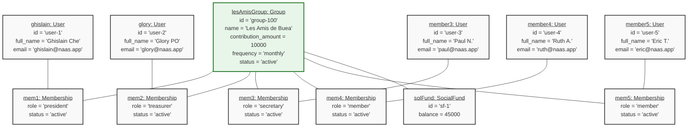
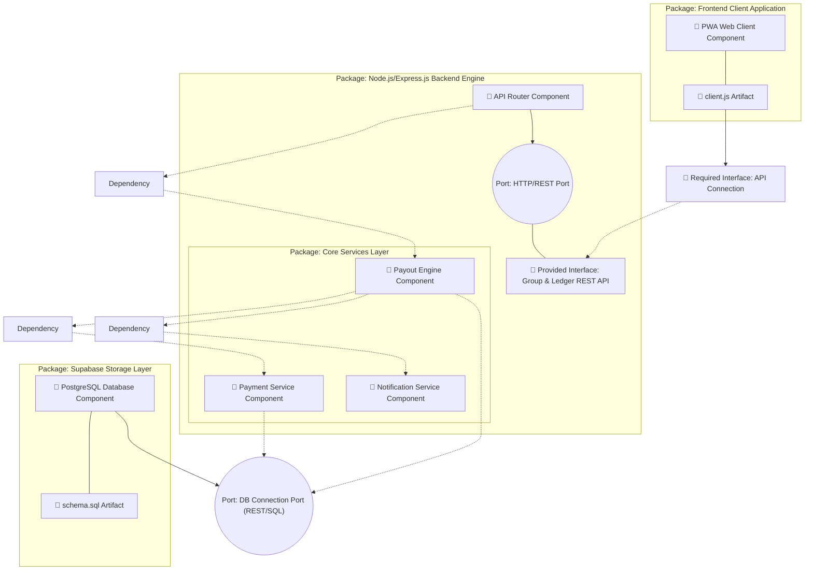
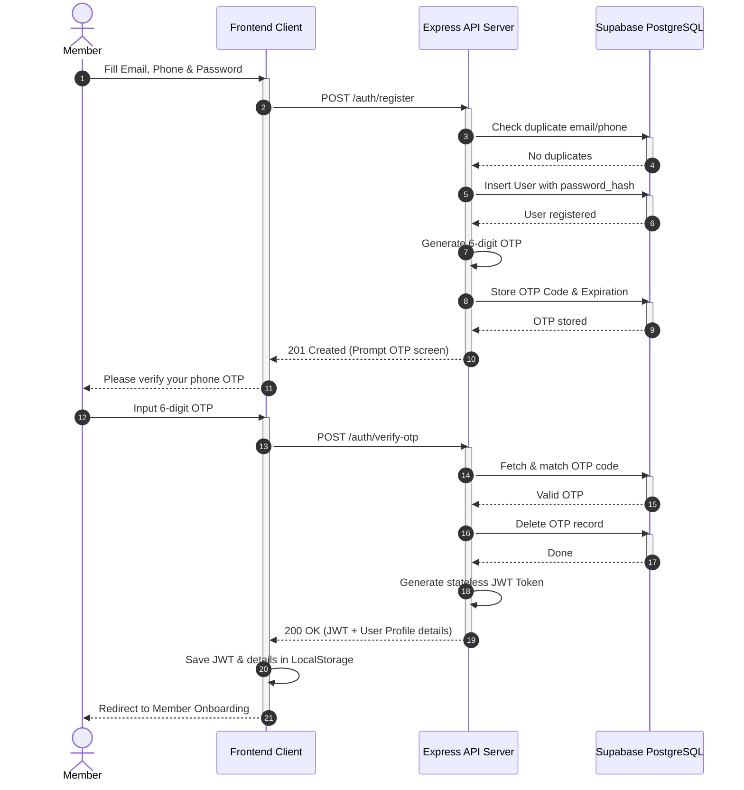
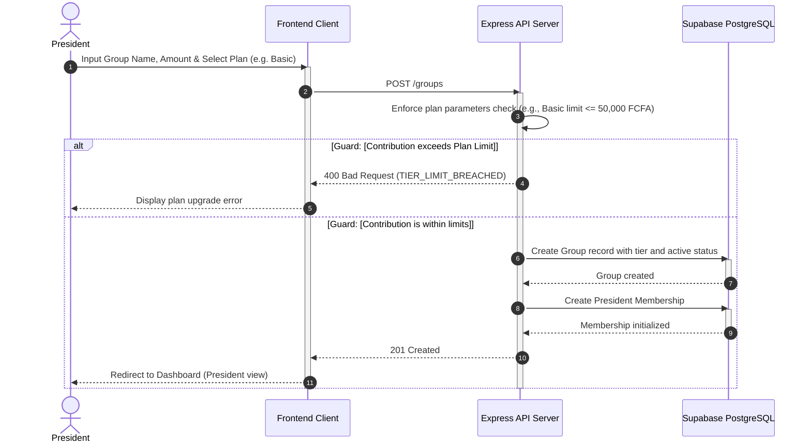
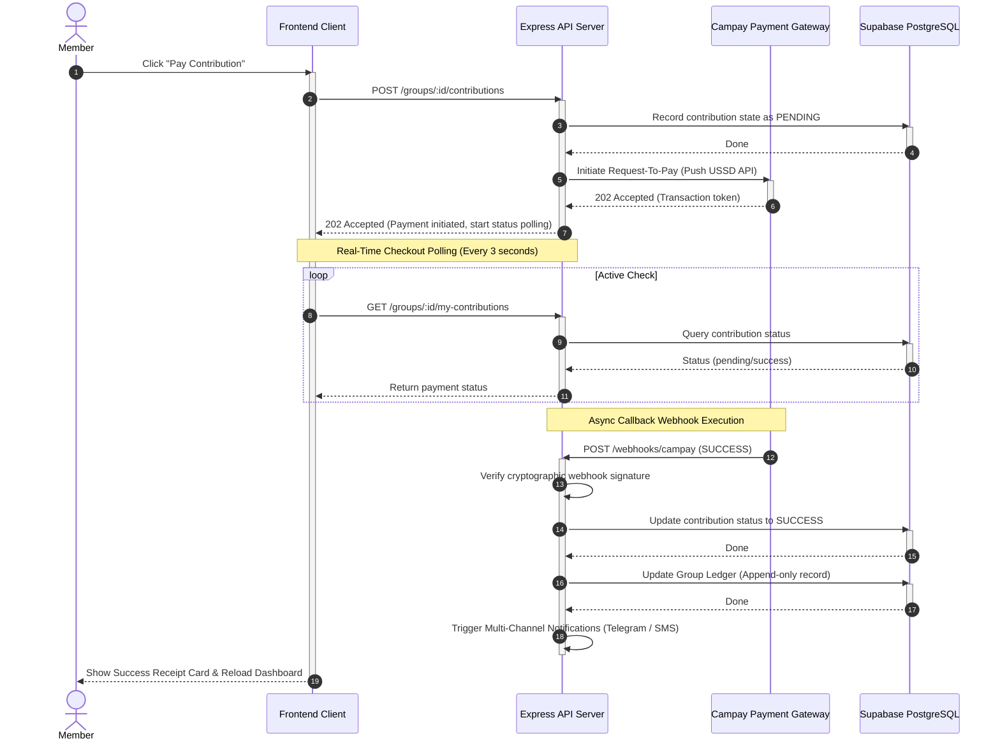
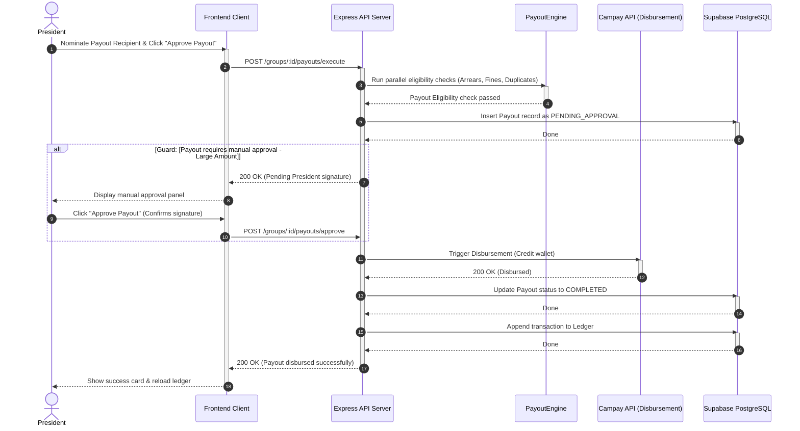
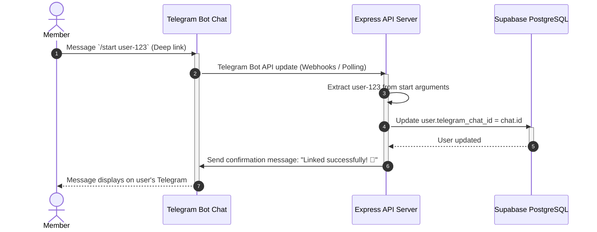

# UML Diagrams (Mermaid)

Here is the complete set of Eraser.io copy-paste Mermaid code blocks for all 9 diagrams (Use Case, Class, Object, Component, and the 5 Sequence diagrams).

To insert these in Eraser.io:
1. Click the (+) (Insert Menu) on your Eraser canvas.
2. Select Diagram-as-code and choose the diagram type (e.g. Flow chart, Class, Sequence).
3. Paste the corresponding code block into the side code editor panel.

---

## 1. UML Use Case Diagram
- Left Side: Primary Actors (users/officers) with Actor generalization.
- Middle Boundary: Use cases containing `<<include>>`, `<<extend>>` and generalization (incorporating Campay Gateway for OM/MTN).
- Right Side: Secondary Actors (External payment and message providers).

```mermaid
flowchart LR
    %% Primary Actors on the Left
    subgraph PrimaryActors ["Primary Actors (Users)"]
        Member["👤 Member"]
        President["👑 President"]
        Treasurer["💰 Treasurer"]
        Secretary["📝 Secretary"]
        PlatformAdmin["⚙️ Platform Admin"]
        
        %% Actor Generalization (hollow arrow pointing from specific to general)
        President --|> Member
        Treasurer --|> Member
        Secretary --|> Member
    end

    %% System Boundary
    subgraph SystemBoundary ["Njangi As A Service System Boundary"]
        %% Use cases
        UC_Auth(["Authenticate User"])
        UC_Ledger(["View Live Ledger"])
        UC_Pay(["Pay Contribution"])
        UC_PayCampay(["Pay via Campay Gateway"])
        UC_PayOM(["Pay via Orange Money"])
        UC_PayMoMo(["Pay via MTN MoMo"])
        
        %% Generalization between Use Cases (hollow arrowhead pointing to general use case)
        UC_PayCampay --|> UC_Pay
        UC_PayOM --|> UC_PayCampay
        UC_PayMoMo --|> UC_PayCampay

        %% Include Relationships (dashed arrows pointing to included case)
        UC_Pay -. "<<include>>" .-> UC_Auth
        UC_Ledger -. "<<include>>" .-> UC_Auth
        
        %% Base Use Case 2
        UC_Payout(["Approve Payout"])
        UC_VerifySig(["Verify President Password"])
        UC_Payout -. "<<include>>" .-> UC_VerifySig

        %% Base Use Case 3 & Extend
        UC_RecordCash(["Record Offline Cash Payment"])
        UC_ApplyFine(["Apply late Penalty Fine"])
        
        %% Extend (dashed arrow pointing from extending use case to base use case)
        UC_ApplyFine -. "<<extend>> (if payment is late)" .-> UC_RecordCash
        
        %% Other Use Cases
        UC_Invite(["Invite Member via Token"])
        UC_Minutes(["Record Meeting Minutes"])
        UC_Social(["Deposit to Social Fund"])
        UC_Tiers(["Configure SaaS Billing Tiers"])
        UC_Suspend(["Suspend / Unsuspend Group"])
        UC_SendAlerts(["Send Event Notifications"])
    end

    %% Secondary Actors on the Right
    subgraph SecondaryActors ["Secondary Actors (External Systems)"]
        CampayGateway["⚡ Campay Payment Gateway"]
        TelegramAPI["🤖 Telegram Bot API"]
        SMSProvider["💬 SMS Provider Gateway"]
    end

    %% Primary Actor to Use Case Associations
    Member --> UC_Ledger
    Member --> UC_Pay
    
    President --> UC_Invite
    President --> UC_Payout
    
    Treasurer --> UC_RecordCash
    Treasurer --> UC_Social
    
    Secretary --> UC_Minutes
    
    PlatformAdmin --> UC_Tiers
    PlatformAdmin --> UC_Suspend

    %% Use Case to Secondary Actor Associations
    UC_PayCampay --> CampayGateway
    UC_Payout --> CampayGateway
    UC_SendAlerts --> TelegramAPI
    UC_SendAlerts --> SMSProvider
    UC_Auth -.-> SMSProvider
```

---

## 2. UML Class Diagram (Showing All Relationships)
- Displays Visibilities (`+`, `-`, `#`, `~`), Generalization (`<|--`), Realization (`<|..`), Composition (`*--`), Aggregation (`o--`), Dependency (`..>`), and multiplicities.

```mermaid
classDiagram
    %% Core Classes
    class User {
        +id: UUID
        +email: String
        +phone: String
        +full_name: String
        #password_hash: String
        -telegram_chat_id: String
        +register(): void
        +login(): String
        +updateProfile(): void
    }

    class Group {
        +id: UUID
        +name: String
        +contribution_amount: Number
        +frequency: String
        +status: String
        ~subscription_tier: String
        +create(): void
        +updateSettings(): void
    }

    class Membership {
        +id: UUID
        +user_id: UUID
        +group_id: UUID
        +role: String
        +status: String
        +updateRole(): void
        +terminate(): void
    }

    class Contribution {
        +id: UUID
        +group_id: UUID
        +user_id: UUID
        +amount: Number
        +status: String
        +payment_method: String
        +record(): void
        +verify(): void
    }

    class Payout {
        +id: UUID
        +group_id: UUID
        +recipient_id: UUID
        +amount: Number
        +status: String
        +execute(): void
        +approve(): void
    }

    class SocialFund {
        +id: UUID
        +group_id: UUID
        +balance: Number
        +recordTransaction(): void
    }

    class AuditLog {
        +id: UUID
        +actor_id: UUID
        +action: String
        +entity: String
        +writeLog(): void
    }

    %% Abstract Strategy & Inheritance (Generalization)
    class RotationStrategy {
        <<abstract>>
        +computeNextRecipient(members: List)* String
    }
    class FixedRotationStrategy {
        +computeNextRecipient(members: List) String
    }
    class RandomDrawStrategy {
        +computeNextRecipient(members: List) String
    }
    RotationStrategy <|-- FixedRotationStrategy : Inheritance (Generalization)
    RotationStrategy <|-- RandomDrawStrategy : Inheritance (Generalization)

    %% Interface & Implementation (Realization)
    class INotificationService {
        <<interface>>
        +send(userId: UUID, message: String)* void
    }
    class TelegramNotificationService {
        +send(userId: UUID, message: String) void
    }
    class SMSNotificationService {
        +send(userId: UUID, message: String) void
    }
    INotificationService <|.. TelegramNotificationService : Realization
    INotificationService <|.. SMSNotificationService : Realization

    %% Dependency (dashed arrow)
    class PayoutEngine {
        -db: DBConnect
        -notificationService: INotificationService
        +executePayout(groupId: UUID, recipientId: UUID): void
    }
    PayoutEngine ..> INotificationService : Dependency

    %% Multiplicity and Structural Relationships (diamonds for composition and aggregation)
    User "1" *-- "0..*" Membership : Composition
    Group "1" *-- "0..*" Membership : Composition
    Group "1" *-- "1" SocialFund : Composition
    Group "1" o-- "0..*" Contribution : Aggregation
    Group "1" o-- "0..*" Payout : Aggregation
    User "1" --> "0..*" AuditLog : Directed Association
```



---

## 3. UML Object Diagram
- Snapshot of a live multi-tenant group setup showing 5 concrete User objects linked to memberships and social balances.



---

## 4. UML Component Diagram
- Models PWA client artifacts, API components, service layers, DB ports, and schema packages.



---

## 5. UML Sequence Diagrams (5 Flows)

### Sequence Diagram 1: User Registration & OTP Verification


### Sequence Diagram 2: Group Creation & Subscription Onboarding


### Sequence Diagram 3: MoMo Contribution Collection (via Campay Gateway)


### Sequence Diagram 4: Payout Execution & Approvals


### Sequence Diagram 5: Telegram Notification Handshake

