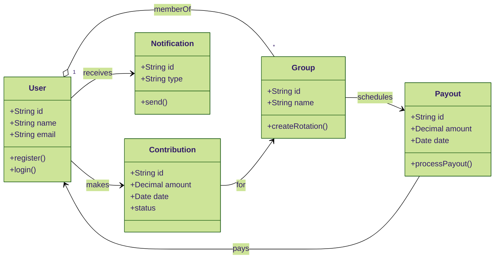
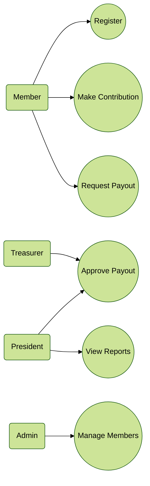
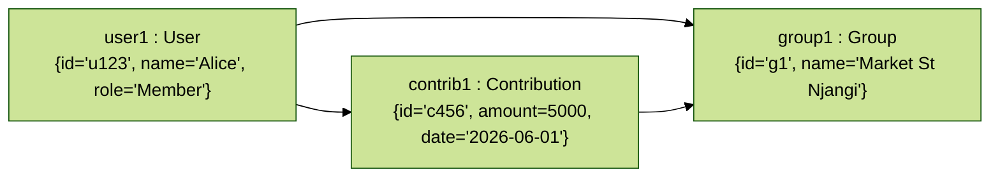
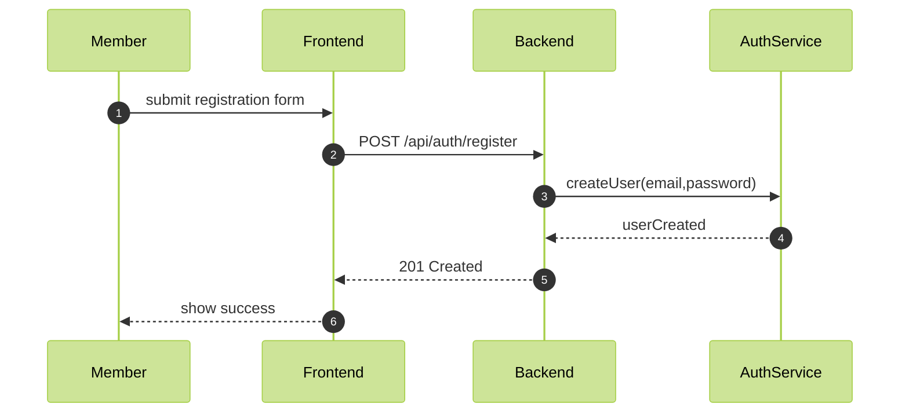
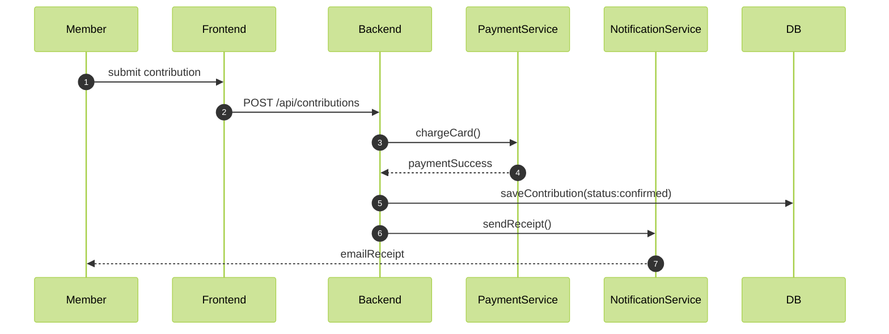
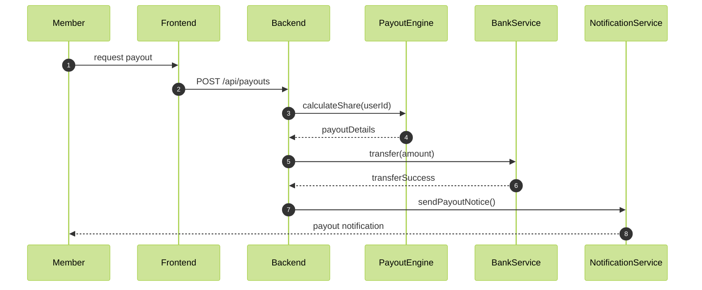

## UML Diagrams

Below are polished Mermaid definitions for a set of UML diagrams representing the Digital Njangi Platform.

### Class Diagram

### Use Case Diagram

### Object Diagram (runtime snapshot)

### Sequence Diagram — Registration

### Sequence Diagram — Contribution Payment

### Sequence Diagram — Payout Flow

