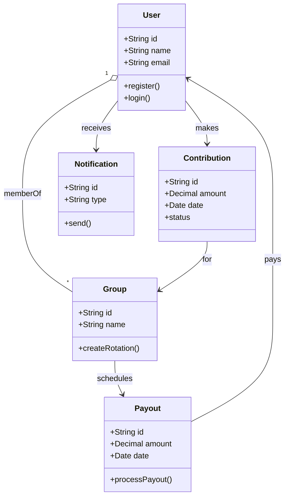
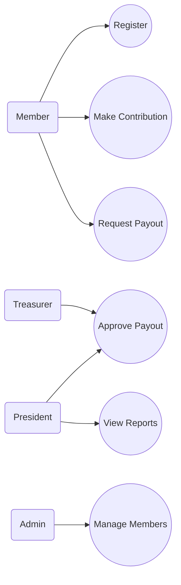
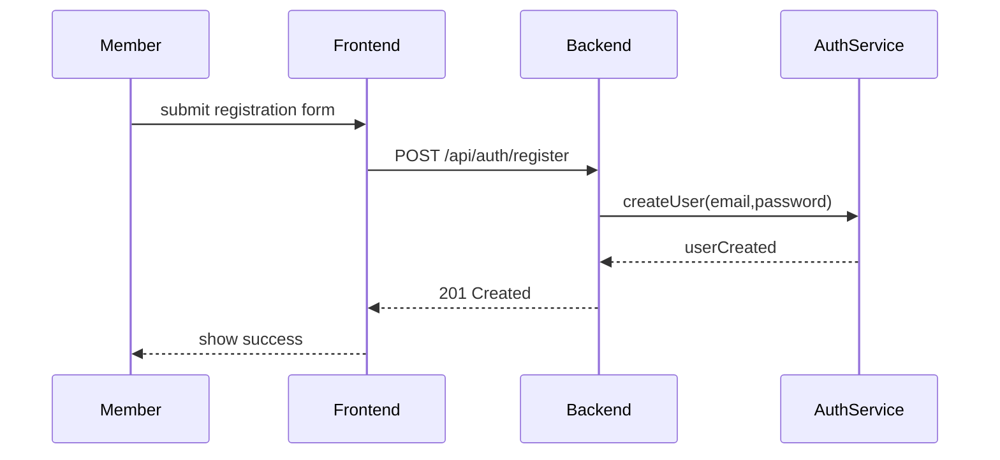
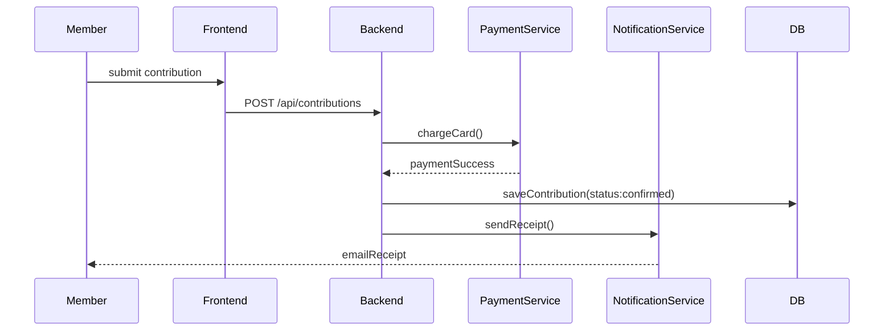

## UML Diagrams

Below are Mermaid definitions for a set of UML diagrams for the Digital Njangi Platform.

### Class Diagram



### Use Case Diagram



### Object Diagram (runtime snapshot)

```mermaid
objectDiagram
    object user1 {
      id: "u123"
      name: "Alice"
      role: Member
    }
    object group1 {
      id: "g1"
      name: "Market St Njangi"
    }
    object contrib1 {
      id: "c456"
      amount: 5000
      date: "2026-06-01"
    }
    user1 --> group1
    user1 --> contrib1
    contrib1 --> group1
```

### Sequence Diagram — Registration



### Sequence Diagram — Contribution Payment


